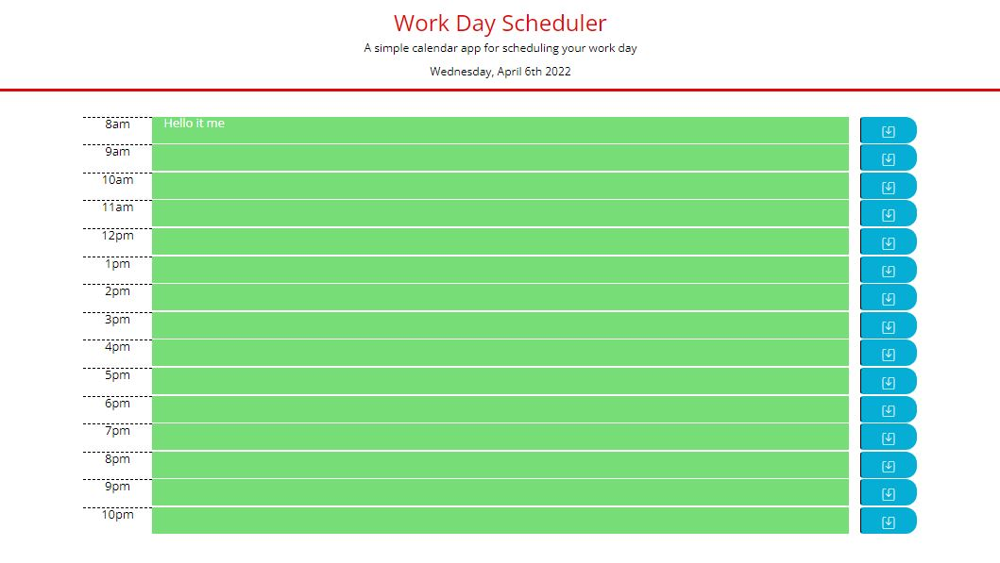
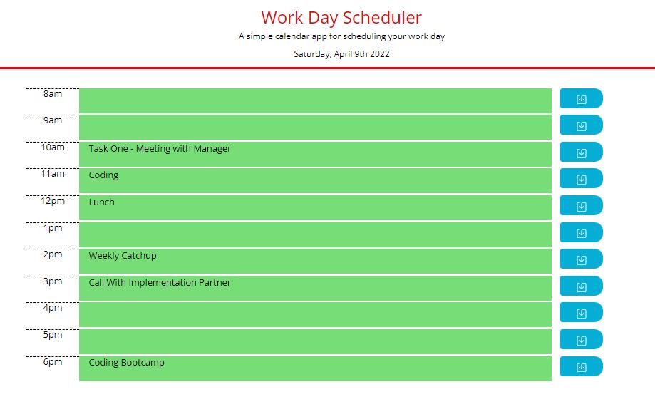

# Work-Day-Scheduler

A easy to use planner to help manage time at work or outside of work!

# Description

This web application uses dynamically created html elements to create an populate a calendar table on the page. Each hour displays a block where the user can enter text for tasks to be completed in that hour. When text is entered, the user can save their calendar by hitting the save button, writing the contents of the calendar to local storage. To increase utility for the user, the hour blocks change color based on the time of day, showing whether the tasks listed are in the past, at the current hour, or upcoming. Finally, the calendar uses moment.js to display the current day on load.

# Acceptance Criteria

GIVEN I am using a daily planner to create a schedule
WHEN I open the planner
THEN the current day is displayed at the top of the calendar
WHEN I scroll down
THEN I am presented with timeblocks for standard business hours
WHEN I view the timeblocks for that day
THEN each timeblock is color coded to indicate whether it is in the past, present, or future
WHEN I click into a timeblock
THEN I can enter an event
WHEN I click the save button for that timeblock
THEN the text for that event is saved in local storage
WHEN I refresh the page
THEN the saved events persist

# Useage

On load, the user is presented with a workday calandar.

The user is able to save calendar entries with the save button, that persist on reload.

